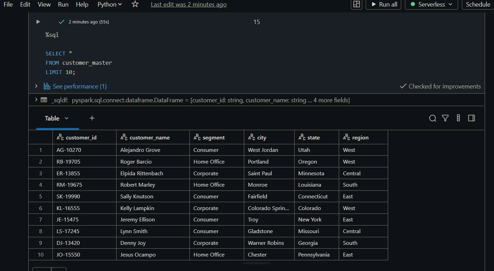
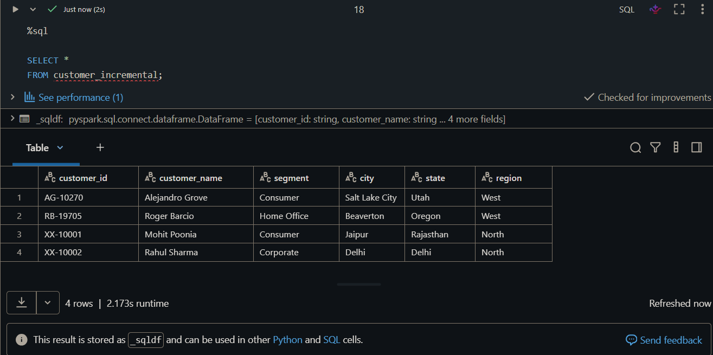
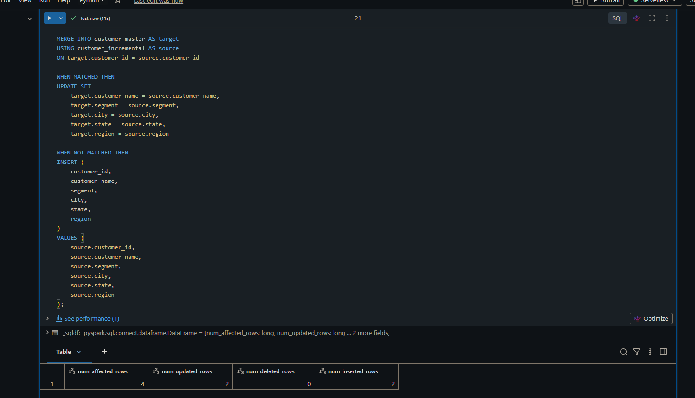
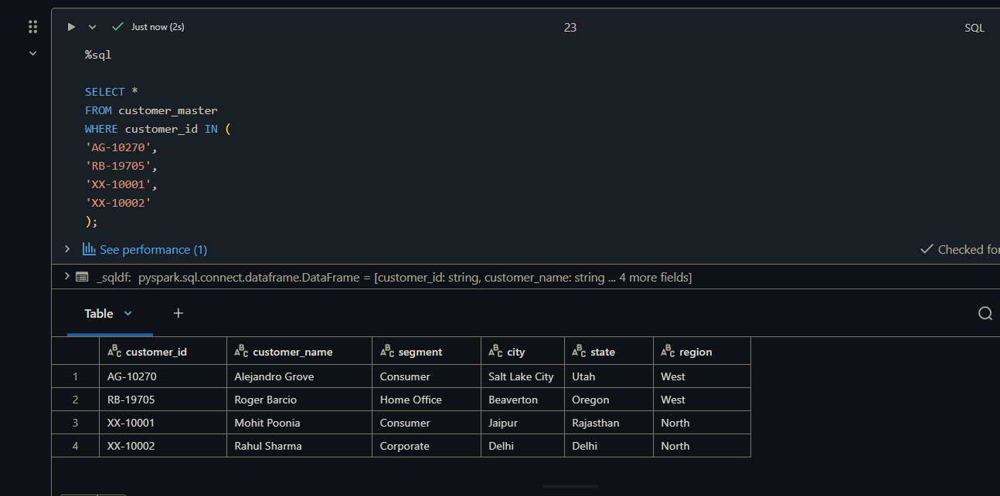
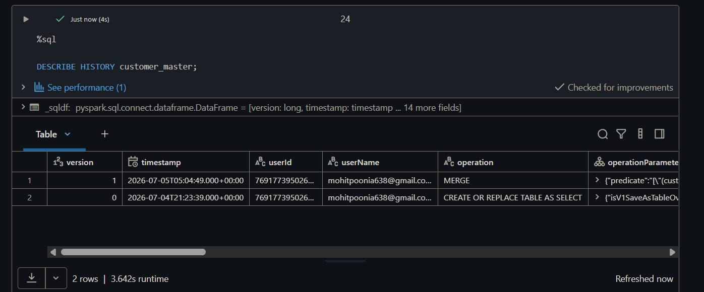
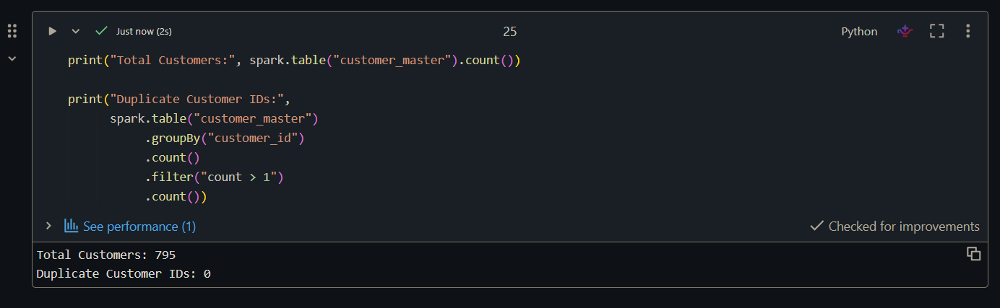

# Delta Lake MERGE Assignment

## Project Overview

This project demonstrates incremental data processing using **Delta Lake MERGE** in **Databricks** with the Sample Superstore dataset.

The objective is to create a Customer Master table, simulate incremental customer data, apply the MERGE operation, and validate the results using Delta Lake features.

---

## Technologies Used

- Databricks Community Edition
- Apache Spark (PySpark)
- Delta Lake
- SQL
- Jupyter Notebook

---

## Dataset

- Sample - Superstore.csv
- Total Records: 9,994
- Total Columns: 21

---

## Workflow

1. Load the Superstore dataset.
2. Perform data exploration.
3. Create the Customer Master dataset.
4. Save Customer Master as a Delta Table.
5. Create an incremental customer dataset.
6. Save incremental data as a Delta Table.
7. Apply the Delta Lake MERGE operation.
8. Validate the updated Customer Master table.
9. View Delta transaction history.

## Screenshots

### Customer Master Delta Table


### Incremental Customer Data


### MERGE Operation


### Final Customer Master


### Delta History


### Validation Results


## MERGE Summary

- Existing Customers Updated: **2**
- New Customers Inserted: **2**
- Duplicate Customer IDs After MERGE: **0**
- Final Customer Count: **795**

---

## Repository Structure

```
delta-lake-merge-assignment/
│
├── data/
│   └── Sample - Superstore.csv
│
├── notebooks/
│   └── delta_scd_assignment.ipynb
│
├── screenshots/
│   ├── 01_customer_master_delta_table.png
│   ├── 02_customer_incremental_delta_table.png
│   ├── 03_merge_operation.png
│   ├── 04_final_customer_master.png
│   ├── 05_delta_history.png
│   └── 06_validation_results.png
```

---

## Key Learning Outcomes

- Delta Table Creation
- Incremental Data Processing
- Delta Lake MERGE
- Update and Insert Operations
- Delta Transaction History
- Data Validation using SQL and PySpark

---

## Conclusion

This project successfully demonstrates how Delta Lake simplifies incremental data processing using a single MERGE statement. Existing customer records were updated, new customers were inserted, and all changes were validated while maintaining transactional consistency.
